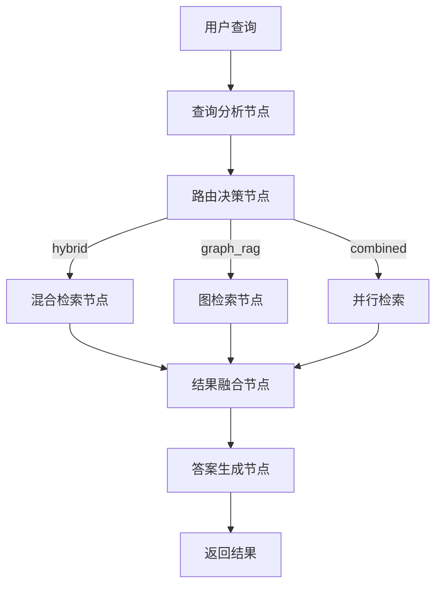

# 烹饪助手 LangGraph GraphRAG 项目

本项目是一个以 **LangGraph** 为编排框架的 **GraphRAG 系统**，采用三层架构设计（Graph → Node → Tool），支持在线智能问答和离线知识库构建两大核心功能。

## 🏗️ 系统架构概览

### 架构分层

```
┌─────────────────────────────────────────────────────────────┐
│                        App 层（业务编排）                      │
├─────────────────────────────────────────────────────────────┤
│ 在线问答系统                    │ 离线构建系统                   │
│ src/app/online_qa/             │ src/app/offline_ingestion/    │
│ ├── graphs/online_qa_graph.py  │ ├── graphs/ingestion_graph.py │
│ ├── nodes/                     │ ├── tools/                    │
│ ├── tools/                     │ └── cli.py                    │
│ ├── state.py                   │                               │
│ ├── checkpointer.py            │                               │
│ └── cli.py                     │                               │
├─────────────────────────────────────────────────────────────┤
│                      Core 层（核心工具）                       │
├─────────────────────────────────────────────────────────────┤
│ Schema层        │ DB客户端层        │ LLM工具层                  │
│ ├── document.py │ ├── neo4j_client  │ ├── llm_client            │
│                 │ ├── milvus_client │ ├── embedding_client      │
│                 │                   │ └── generation_tool       │
├─────────────────────────────────────────────────────────────┤
│                     Legacy 层（兼容实现）                      │
├─────────────────────────────────────────────────────────────┤
│ src/legacy/rag_modules/    │ src/legacy/agent/               │
│ ├── generation_integration │ ├── recipe_ai_agent             │
│ ├── hybrid_retrieval      │ └── ...                          │
│ ├── graph_rag_retrieval   │                                 │
│ └── ...                   │                                 │
└─────────────────────────────────────────────────────────────┘
```

## 🔄 在线问答系统流程

### 图结构工作流



### 节点职责详解

| 节点 | 职责 | 写入State字段 | 依赖工具 |
|------|------|---------------|----------|
| `query_analysis_node` | 分析查询意图和关键词 | `analysis` | QueryAnalysisTool |
| `route_node` | 决定检索策略 | `route` | QueryRouterTool |
| `hybrid_retrieve_node` | 执行混合检索 | `hybrid_docs` | HybridSearchTool |
| `graph_retrieve_node` | 执行图检索 | `graph_docs` | GraphRAGSearchTool |
| `fuse_node` | 融合检索结果 | `fused_docs` | FusionTool |
| `answer_node` | 生成最终答案 | `answer`, `history` | AnswerGenerationTool |

### 多轮对话机制

**双层会话管理**：
1. **进程内会话**：通过LangGraph的`MemorySaver`实现
2. **跨进程会话**：通过`.session_history/`目录持久化

```bash
# 创建会话
python -m src.app.online_qa --session-id user-001 --query "红烧肉怎么做？"

# 继续对话
python -m src.app.online_qa --session-id user-001 --query "可以用电饭锅吗？"
```

## 📥 离线知识构建流程

### 数据处理流水线


### 工具链分工

| 工具 | 功能 | 并发度 | 输出 |
|------|------|--------|------|
| `scan_files.py` | 扫描菜谱文件 | 单线程 | 文件列表 |
| `parse_tool.py` | 解析菜谱内容 | 可配置 | 结构化数据 |
| `build_tool.py` | 数据预处理 | 批次处理 | 清洗后数据 |
| `export_tool.py` | 导出Neo4j格式 | 单线程 | CSV文件 |
| `progress_tool.py` | 进度管理 | 单线程 | 断点续跑 |

## 🚀 快速开始

### 1. 环境准备

```bash
# 克隆项目
git clone <repository-url>
cd C9

# 安装依赖
pip install -r requirements.txt

# 创建环境配置
cp .env.example .env
# 编辑 .env 填入必要的API密钥和数据库连接信息
```

### 2. 配置环境变量

```bash
# LLM配置（必需）
MOONSHOT_API_KEY=your_api_key_here
MOONSHOT_BASE_URL=your_base_url_here

# 数据库配置（在线问答必需）
NEO4J_URI=bolt://localhost:7687
NEO4J_USER=neo4j
NEO4J_PASSWORD=your_password
NEO4J_DATABASE=neo4j

MILVUS_HOST=localhost
MILVUS_PORT=19530
MILVUS_COLLECTION_NAME=cooking_knowledge
```

### 3. 运行在线问答

```bash
# 交互式问答
python -m src.app.online_qa

# 单次查询
python -m src.app.online_qa --query "红烧肉怎么做？"

# 流式输出
python -m src.app.online_qa --stream --query "推荐几个下饭的家常菜"

# 带会话ID的多轮对话
python -m src.app.online_qa --session-id user-001 --query "红烧肉怎么做？"
python -m src.app.online_qa --session-id user-001 --query "可以用电饭锅吗？"

# 可直接在CLI中选择历史对话
python -m src.app.online_qa
请选择模式：
  1. 历史对话
  2. 单次对话（不保存历史）
```

### 4. 构建知识库

```bash
# 基础构建
python -m src.app.offline_ingestion ./recipes -o ./ai_output

# 带恢复功能的构建
python -m src.app.offline_ingestion ./recipes -o ./ai_output --resume

# 自定义参数构建
python -m src.app.offline_ingestion ./recipes \
  -o ./ai_output \
  --batch-size 20 \
  --parse-concurrency 3 \
  --output-format neo4j
```

## 🧪 测试与验证

### 单元测试

```bash
# 运行所有测试
python -m unittest discover -s tests -p "test_*.py" -v

# 运行特定测试
python -m unittest tests.test_online_qa_graph -v
python -m unittest tests.test_fusion -v
```

### 集成测试

```bash
# 测试在线问答
python -c "from src.app.online_qa.graphs.online_qa_graph import build_graph; g = build_graph(); print('Graph构建成功')"

# 测试离线构建
python -c "from src.app.offline_ingestion.graphs.ingestion_graph import build_graph; g = build_graph(); print('Ingestion图构建成功')"
```

## 📁 目录结构详解

```
C9/
├── src/
│   ├── app/
│   │   ├── online_qa/          # 在线问答系统
│   │   │   ├── graphs/         # 图定义
│   │   │   ├── nodes/          # 节点实现（6个节点）
│   │   │   ├── tools/          # 工具封装
│   │   │   ├── state.py        # 状态定义
│   │   │   ├── checkpointer.py # 会话管理
│   │   │   └── cli.py          # 命令行接口
│   │   ├── offline_ingestion/  # 离线构建系统
│   │   └── config.py           # 配置管理
│   ├── core/                   # 核心基础设施
│   │   ├── schemas/            # 数据模型
│   │   └── tools/              # 通用工具
│   └── legacy/                 # 兼容层
├── tests/                      # 测试用例
├── .session_history/           # 会话持久化
└── docs/                       # 项目文档
```

## 🔧 配置管理

### 核心配置项

| 配置项 | 说明 | 默认值 |
|--------|------|--------|
| `embedding_model` | 嵌入模型 | BAAI/bge-small-zh-v1.5 |
| `llm_model` | 大语言模型 | kimi-k2-0711-preview |
| `top_k` | 检索结果数量 | 5 |
| `chunk_size` | 文本分块大小 | 500 |
| `chunk_overlap` | 分块重叠大小 | 50 |
| `max_graph_depth` | 图检索深度 | 2 |

### 环境变量优先级

1. 环境变量 > 配置文件 > 默认值
2. 敏感信息（API密钥）必须通过环境变量配置

## 📊 性能优化建议

### 在线问答优化
- 调整`top_k`参数平衡精度与速度
- 使用流式输出减少等待时间
- 合理设置会话历史长度

### 离线构建优化
- 根据CPU核心数调整`--parse-concurrency`
- 根据内存大小调整`--batch-size`
- 使用SSD存储加速索引构建

## 🎯 故障排查

### 常见问题

1. **连接超时**：检查Neo4j和Milvus服务状态
2. **API限制**：确认MOONSHOT_API_KEY有效且未超限
3. **会话丢失**：检查`.session_history/`目录权限
4. **索引缺失**：运行离线构建流程

### 调试命令

```bash
# 检查服务状态
python -c "from src.core.tools.db.neo4j_client import get_neo4j_client; print('Neo4j连接成功')"
python -c "from src.core.tools.db.milvus_client import get_milvus_client; print('Milvus连接成功')"

# 验证配置
python -c "from src.app.config import DEFAULT_CONFIG; print(DEFAULT_CONFIG)"
```

## 🤝 贡献指南

1. **代码规范**：遵循PEP8标准
2. **测试要求**：新增功能必须包含单元测试
3. **文档更新**：API变更需同步更新文档
4. **提交规范**：使用清晰的commit message

## 📄 许可证

本项目采用MIT许可证，详见[LICENSE](LICENSE)文件。

---

**版本**: v2.2  
**更新时间**: 2026-03-12  